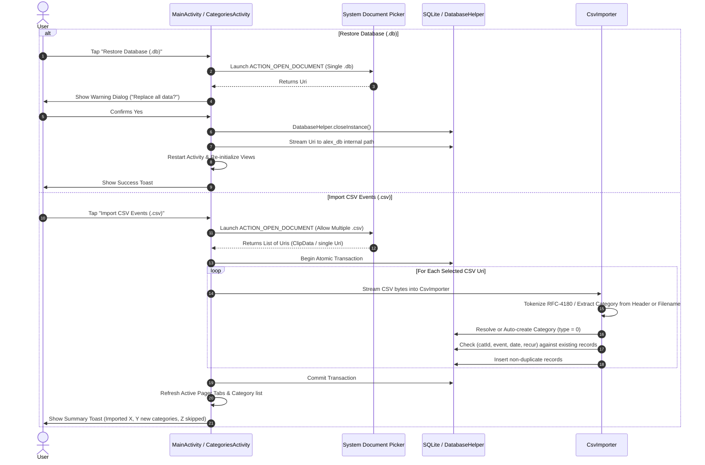

# Design Change Request (DCR): Overflow Menu Reorganization & Unified Data I/O (SAF, Full DB Backup & CSV Surfacing)

**Document ID:** DCR-2026-08-01  
**Target Component:** Main Activity Overflow Menu, Categories Activity, Storage Access Framework (SAF), Backup/Restore & CSV Engine  
**Status:** Approved Specification  
**Author:** DaysSincePro Architecture

---

## 1. Executive Summary & Goals

This document defines the user experience (UX), functional rules, data-flow architecture, and technical requirements for:

1. **Reorganizing the Main Activity Overflow Menu** into logical semantic buckets with visual dividers using native Android `<group>` tags and hierarchical submenus for both Export and Import.
2. **Surfacing Full Database Export & Import**: Standardizing backups as `daysSince.db` (full SQLite snapshot) and `daysSince.csv` (complete database export across all categories with human-readable category labels).
3. **Transitioning to Modern Storage Access Framework (SAF) Across the App**: Replacing legacy custom file browsers (`FileExplore`) and direct filesystem paths with system document pickers (`ACTION_CREATE_DOCUMENT` and `ACTION_OPEN_DOCUMENT`) across `MainActivity` and `CategoriesActivity`.
4. **Retiring Legacy Storage Permissions**: Eliminating runtime `WRITE_EXTERNAL_STORAGE` / `READ_EXTERNAL_STORAGE` permission checks, callback boilerplate, and deprecated filesystem branches.
5. **Implementing Smart Multi-File CSV Merge & Deduplication**: Supporting multi-file selection to allow batch-importing multiple category-level exports (`<categoryName>.csv`), performing automatic category resolution/creation (including filename stem inference when the `category` column is omitted), and enforcing strict de-duplication based on `(catId, event, date, recur)` tuples.

---

## 2. Menu Hierarchy & Structure

### 2.1 Bucket Categorization & Ordering

The overflow menu in [app/src/main/res/menu/menu_main.xml](app/src/main/res/menu/menu_main.xml) is structured into three distinct `<group>` elements in the following order:

```mermaid
graph TD
    Root[Main Overflow Menu] --> GroupActions[Group 1: Actions]
    Root --> GroupData[Group 2: Data I/O]
    Root --> GroupMeta[Group 3: Meta]

    GroupActions --> DaysDiff[Days Between]
    GroupActions --> Notify[Notify]

    GroupData --> ExportSub[Export to file(s) >]
    GroupData --> ImportSub[Import from file(s) >]

    ExportSub --> ExpDB[SQLite Database .db]
    ExportSub --> ExpCSV[CSV File .csv]

    ImportSub --> ImpDB[Restore Database .db]
    ImportSub --> ImpCSV[Import CSV Events .csv]

    GroupMeta --> Settings[Settings]
    GroupMeta --> About[About]
```

### 2.2 Visual Representation

```text
+------------------------------------+
| Days Between                       |  <- Group 1: Actions
| Notify                             |
+------------------------------------+  <- Native Group Divider
| Export to file(s)               >  |  <- Group 2: Data I/O (Submenu)
|   ├─ SQLite Database (.db)         |
|   └─ CSV File (.csv)               |
| Import from file(s)             >  |  <- Group 2: Data I/O (Submenu)
|   ├─ Restore Database (.db)        |     (Single file, destructive replace)
|   └─ Import CSV Events (.csv)      |     (Multi-file allowed, append & deduplicate)
+------------------------------------+  <- Native Group Divider
| Settings                           |  <- Group 3: Meta
| About                              |
+------------------------------------+
```

### 2.3 Proposed Menu XML Specification (`menu_main.xml`)

```xml
<menu xmlns:android="http://schemas.android.com/apk/res/android"
    xmlns:app="http://schemas.android.com/apk/res-auto">

    <!-- Action Bar Persistent Icons -->
    <item
        android:id="@+id/action_add"
        android:orderInCategory="10"
        android:icon="@android:drawable/ic_menu_add"
        android:title="@string/add"
        app:showAsAction="always" />

    <item
        android:id="@+id/action_open"
        android:orderInCategory="20"
        android:icon="@drawable/ic_action_file_folder_open"
        android:title="@string/categories"
        app:showAsAction="always" />

    <item
        android:id="@+id/action_search"
        android:orderInCategory="30"
        android:icon="@android:drawable/ic_menu_search"
        android:title="@string/search"
        app:actionViewClass="androidx.appcompat.widget.SearchView"
        app:showAsAction="ifRoom|collapseActionView" />

    <!-- GROUP 1: ACTIONS -->
    <group android:id="@+id/menu_group_actions" android:orderInCategory="100">
        <item
            android:id="@+id/menu_daysdiff"
            android:title="@string/days_diff"
            app:showAsAction="never" />
        <item
            android:id="@+id/menu_notify"
            android:title="@string/notify"
            app:showAsAction="never" />
    </group>

    <!-- GROUP 2: DATA I/O -->
    <group android:id="@+id/menu_group_data_io" android:orderInCategory="200">
        <!-- Export Submenu -->
        <item
            android:id="@+id/menu_export_parent"
            android:title="@string/export_to_files"
            app:showAsAction="never">
            <menu>
                <item
                    android:id="@+id/menu_export_db"
                    android:title="@string/export_db_option" />
                <item
                    android:id="@+id/menu_export_csv"
                    android:title="@string/export_csv_option" />
            </menu>
        </item>

        <!-- Import Submenu -->
        <item
            android:id="@+id/menu_import_parent"
            android:title="@string/import_from_files"
            app:showAsAction="never">
            <menu>
                <item
                    android:id="@+id/menu_import_db"
                    android:title="@string/restore_db_option" />
                <item
                    android:id="@+id/menu_import_csv"
                    android:title="@string/import_csv_option" />
            </menu>
        </item>
    </group>

    <!-- GROUP 3: META -->
    <group android:id="@+id/menu_group_meta" android:orderInCategory="300">
        <item
            android:id="@+id/action_settings"
            android:title="@string/action_settings"
            app:showAsAction="never" />
        <item
            android:id="@+id/menu_about"
            android:icon="@android:drawable/ic_dialog_info"
            android:title="@string/about"
            app:showAsAction="never" />
    </group>

</menu>
```

---

## 3. Storage Access Framework (SAF) & Deprecations

### 3.1 Migration from Legacy Storage to SAF

- **Current Limitation:** The legacy code uses `FileExplore` or direct filesystem paths (`Environment.getExternalStorageDirectory()`), which requires `WRITE_EXTERNAL_STORAGE` on older Android versions and encounters scoped storage restrictions on Android 11+ (API 30+).
- **SAF Solution:**
  - **Exports:** Launch `Intent.ACTION_CREATE_DOCUMENT` with suggested filenames (`daysSince.db` and `daysSince.csv`). No runtime storage permissions required.
  - **Imports:** Launch `Intent.ACTION_OPEN_DOCUMENT`. Supports single file for `.db` and multi-file selection for `.csv` across local storage, Downloads, Google Drive, SD cards, and USB OTG.
- **Deprecations & Code Cleanup:**
  1. **Retire `FileExplore.java`**: Remove `FileExplore.java` and its `<activity>` registration in `AndroidManifest.xml`.
  2. **Eliminate Permission Handlers**: Remove `Manifest.permission.WRITE_EXTERNAL_STORAGE` / `READ_EXTERNAL_STORAGE` checks, `beforeBackup()`, and `onRequestPermissionsResult()` from both `MainActivity` and `CategoriesActivity`.

---

## 4. Export Workflow Specifications

### 4.1 Export to `.db` (Full SQLite Snapshot)

- **Trigger:** Main Overflow Menu $\rightarrow$ Export to file(s) $\rightarrow$ SQLite Database (.db)
- **Intent:** `ACTION_CREATE_DOCUMENT`
- **MIME Types:** `application/vnd.sqlite3`, `application/x-sqlite3`, `application/octet-stream`
- **Default Filename:** `daysSince.db`
- **Execution:**
  1. Generate a consistent point-in-time SQLite snapshot to a temporary app-cache file using `VACUUM INTO ?`.
  2. Stream the snapshot bytes from cache to the SAF target `Uri` via `getContentResolver().openOutputStream(uri)`.
  3. Delete the temporary cache file.
  4. Display confirmation dialog/toast.

### 4.2 Export to `.csv` (All Events across All Categories)

- **Trigger:** Main Overflow Menu $\rightarrow$ Export to file(s) $\rightarrow$ CSV File (.csv)
- **Intent:** `ACTION_CREATE_DOCUMENT`
- **MIME Types:** `text/csv`, `text/comma-separated-values`, `text/plain`
- **Default Filename:** `daysSince.csv`
- **Execution:**
  1. Open `OutputStream` to the target SAF `Uri` via `getContentResolver().openOutputStream(uri)`.
  2. Wrap in `OutputStreamWriter(out, StandardCharsets.UTF_8)` and `BufferedWriter`.
  3. Execute `CsvExporter.exportAllCategories(db, writer)`:
     - Emits RFC-4180 header: `"category","event","date","recur"`
     - Resolves human-readable category text name for every event.
     - Enforces ISO-8601 dates (`yyyy-MM-dd`), escaped internal quotes (`""`), and standard UTF-8 without BOM.
  4. Display toast with total events exported.

### 4.3 Category Context-Menu Export (Single Category)

- **Trigger:** Long-press category item in `CategoriesActivity` $\rightarrow$ "Export as CSV"
- **Intent:** `ACTION_CREATE_DOCUMENT`
- **Default Filename:** `<CategoryName>.csv`
- **Execution:**
  1. Stream single-category events using `CsvExporter.exportCategory(db, categoryId, writer)`.
  2. Emits RFC-4180 header: `"event","date","recur"`.

---

## 5. Import Workflow & Semantic Rules



### 5.1 Mode A: Restore Database (`.db` — Full Replacement)

1. **Trigger:** Main Overflow Menu $\rightarrow$ Import from file(s) $\rightarrow$ Restore Database (.db)
2. **Picker Configuration:** Single-file selection (`EXTRA_ALLOW_MULTIPLE = false`). MIME filters for SQLite/database files.
3. **Behavior:**
   - **Destructive Replace:** Replaces existing SQLite database entirely.
   - **User Confirmation:** Displays confirmation alert dialog informing the user that all current app data will be replaced.
   - **Connection Lifecycle Management:**
     - Closes active singleton connection via `DatabaseHelper.closeInstance()`.
     - Streams bytes from SAF `Uri` directly to the app's internal database path (`/data/data/com.MerWare.DaysSincePro/databases/alex_db`).
     - Forces Activity restart (`CLEAR_TOP | NEW_TASK`) to re-initialize SQLite connections and reload all tabs/fragments cleanly.

### 5.2 Mode B: Import CSV Events (`.csv` — Append & Deduplicate)

1. **Trigger:**
   - Main Overflow Menu $\rightarrow$ Import from file(s) $\rightarrow$ Import CSV Events (.csv) (Multi-file allowed).
   - Long-press in `CategoriesActivity` $\rightarrow$ "Import events from CSV" (Single-file targeted to selected category).
2. **Picker Configuration:** Multi-file selection (`EXTRA_ALLOW_MULTIPLE = true`) in Main Menu; single-file selection in `CategoriesActivity`.
3. **Behavior:**
   - **Non-Destructive Append:** Existing records are preserved.
   - **Category Resolution Hierarchy:**
     1. **Header Column:** If the CSV contains a `category` column, parse and use the category name for each row.
     2. **Filename Inference:** If the `category` column is omitted (e.g. category export `<CategoryName>.csv`), inspect the document's display name from `OpenableColumns.DISPLAY_NAME`. If named `Vehicles.csv`, automatically assign to category `"Vehicles"`.
     3. **Targeted UI Fallback:** If launched from `CategoriesActivity` context menu, use the selected category.
     4. **Default Fallback:** Assign to `"Uncategorized"` (catId 0 or null).
   - **Auto-Creation of Missing Categories:** Any referenced category that does not exist in SQLite is automatically inserted into the `category` table (`type = 0`).
   - **Composite-Key Deduplication:**
     - Before inserting, verify if an event already exists matching the tuple:
       $$\text{Key} = (\text{catId}, \text{event\_name}, \text{iso\_date}, \text{recur})$$
     - Existing events are skipped to avoid duplicate entries during repeated imports.
   - **Transactional Integrity:** The entire import batch across all files is executed inside an atomic transaction (`beginTransaction()`).
   - **UI Refresh & Reporting:** Refreshes all active ViewPager tabs (`refreshTabs()`) and displays a summary toast:
     `Imported X events (Y new categories), Z duplicates skipped.`

---

## 6. Additional Considerations & Edge Cases

1. **Document Name Resolution under SAF**:
   - Query `OpenableColumns.DISPLAY_NAME` via `ContentResolver` to accurately retrieve the original filename (e.g., `Vehicles.csv`) for category inference.
2. **Large File Streaming & Memory Efficiency**:
   - Stream CSV content directly using buffered readers without buffering the entire raw file into memory strings.
3. **Backward Compatibility with Legacy Single-Quoted CSVs**:
   - Ensure the tokenizing engine in `CsvImporter` continues to support legacy single-quoted CSV formats (e.g., `ManualPayments.csv`) alongside RFC-4180 standard double-quoted CSVs.
4. **App Restart vs Dynamic Fragment Reload**:
   - DB Restore requires activity restart (`CLEAR_TOP`) to re-bind SQLite helpers.
   - CSV Import does not require restarting the activity; calling `refreshTabs()` and updating cursor adapters in `CategoriesActivity` is sufficient.
5. **Separation of Contexts**:
   - Main menu handles database-level actions (`daysSince.db`, `daysSince.csv`, multi-CSV batch import).
   - Category context menu handles category-specific actions (`<CategoryName>.csv`). Both utilize the unified `CsvExporter` and `CsvImporter` cores.
6. **Internal Database File Naming (`alex_db`) & Eliminating Hardcoded Paths**:
   - The live internal SQLite file name remains `alex_db` (defined in `DatabaseHelper.DATABASE_NAME = "alex_db"`).
   - This file is internal, private, and completely invisible to end-users (who only ever see `daysSince.db` during export/import).
   - **Eliminate Hardcoded Path Strings**: Replace legacy hardcoded strings like `"/data/data/com.MerWare.DaysSincePro/databases/alex_db"` with standard Android context resolution:
     ```java
     File liveDbFile = context.getDatabasePath(DatabaseHelper.DATABASE_NAME);
     ```
   - This ensures safe, dynamic path resolution across multi-user profiles, emulators, and custom Android OS builds.
7. **Future Consideration: Internal Database Rename Migration Strategy**:
   - If `alex_db` is ever renamed internally (e.g. to `dayssince.db`), a strict on-startup migration check is mandatory to prevent P0 catastrophic data loss for existing users:
     ```java
     File oldDb = context.getDatabasePath("alex_db");
     File newDb = context.getDatabasePath("dayssince.db");
     if (oldDb.exists() && !newDb.exists()) {
         oldDb.renameTo(newDb);
     }
     ```
   - For this DCR, `alex_db` is retained internally to guarantee zero upgrade risk, and as homage to the original Author Alex Mak. Kudos and thanks again Alex!

---

## 7. Risk Analysis & Mitigation Matrix

| #   | Risk Description                                           | Potential Impact                                                                              | Severity | Mitigation Strategy                                                                                                                       |
| --- | ---------------------------------------------------------- | --------------------------------------------------------------------------------------------- | -------- | ----------------------------------------------------------------------------------------------------------------------------------------- |
| 1   | **SAF URI Resolution on Third-Party Providers**            | Google Drive / Cloud providers might return opaque URIs or null `DISPLAY_NAME`.               | Medium   | Query `OpenableColumns.DISPLAY_NAME` with safe null fallback; if category cannot be inferred from filename, default to `"Uncategorized"`. |
| 2   | **SQLite Lock / State Inconsistency during `.db` Restore** | Overwriting database while active query is open could crash or corrupt cursor.                | High     | Call `DatabaseHelper.closeInstance()`, copy file bytes, and force Activity restart (`FLAG_ACTIVITY_CLEAR_TOP \| FLAG_ACTIVITY_NEW_TASK`). |
| 3   | **Category Case-Sensitivity & Whitespace Collisions**      | Variations like `"Vehicles "` vs `"vehicles"` creating duplicate categories during CSV merge. | Low      | Enforce `.trim()` and use `COLLATE NOCASE` SQLite query lookup before category creation.                                                  |
| 4   | **Date Format Mismatch during Deduplication**              | Divergent date representations (e.g. `2024-5-1` vs `2024-05-01`) failing duplicate match.     | Medium   | Canonicalize all incoming and database dates to strict ISO-8601 (`yyyy-MM-dd`) before generating deduplication hash keys.                 |
| 5   | **Memory Overhead during Large Multi-CSV Batch Import**    | High memory consumption if buffering multiple files.                                          | Low      | Stream each file through `BufferedReader` directly into parameterized `SQLiteDatabase.insert()` within a single batch transaction.        |

---

## 8. Test Strategy & Regression Suite

To ensure stability and prevent future regressions, the following test coverage will be added:

1. **JVM SQLite Unit Tests (`app/src/test/` using `sqlite-jdbc`)**:
   - `testBatchCsvImportWithDeduplication()`: Verify importing multiple CSV files with overlapping events ignores duplicates.
   - `testCategoryAutoCreation()`: Verify new categories are created on-the-fly when encountered in CSV rows or inferred from filenames.
   - `testDateNormalizationInDeduplication()`: Verify dates formatted as `yyyy-MM-dd` and `yyyy/MM/dd` resolve to the same deduplication key.
   - `testFilenameCategoryInference()`: Verify filename stems (e.g., `Car Maintenance.csv` $\rightarrow$ `"Car Maintenance"`) are accurately extracted.
   - `testFullDatabaseExportImportRoundTrip()`: Export all categories to CSV, import into an empty database, and assert row-by-row equality.
2. **Menu Inflation & Handler Verification**:
   - Verify all group IDs, submenu items, and action handlers in `menu_main.xml` are tested and covered.

---

## 9. Implementation Checklist

- [ ] **String Resources (`strings.xml`)**: Add strings for menu options, submenus, and summary dialogs.
- [ ] **Menu Layout (`menu_main.xml`)**: Implement `<group>` hierarchy and nested `<menu>` submenus for both Export and Import.
- [ ] **Retire `FileExplore.java`**: Remove `FileExplore.java` source file and its `<activity>` registration in `AndroidManifest.xml`.
- [ ] **Storage Permissions Cleanup**: Remove runtime permission requests (`WRITE_EXTERNAL_STORAGE`, `beforeBackup()`, `onRequestPermissionsResult()`) from `MainActivity` and `CategoriesActivity`.
- [ ] **SAF Integration in `MainActivity`**:
  - Implement `launchExportDbPicker()` & `launchExportCsvPicker()`.
  - Implement `launchRestoreDbPicker()` & `launchImportCsvPicker()`.
  - Replace hardcoded db path strings with `context.getDatabasePath(DatabaseHelper.DATABASE_NAME)`.
  - Implement `onActivityResult` handlers for SAF request codes (`Uri` / `ClipData`).
- [ ] **SAF Integration in `CategoriesActivity`**: Update context-menu export/import to use SAF `ACTION_CREATE_DOCUMENT` and `ACTION_OPEN_DOCUMENT`.
- [ ] **Deduplication & Category Inference in `CsvImporter`**: Enhance `CsvImporter` with composite-key duplicate filtering and document display-name inference.
- [ ] **Unit & Regression Testing**: Validate menu rendering, SAF stream copy, duplicate skipping, and category creation.

---

## 10. Post Completion Updates (2026-09-04)

### Corner case: full export renamed to daysSince1.csv created an empty daysSince1 category on import

1. Scenario:
  - User exports full database CSV (contains category column), renames file to `daysSince1.csv`, then imports.
2. Prior completion behavior:
  - Import path inferred `daysSince1` from filename and pre-created that category before reading row-level header semantics.
  - Because row-level category values were present, imported rows were routed to their own explicit categories.
  - Result: a new empty `daysSince1` category existed with no events.
3. Remedy implemented:
  - Import now parses records first and checks header semantics.
  - Filename category inference is only applied when category header is absent.
  - If a category header exists, filename inference is skipped entirely for that file.
4. Impact forward:
  - Renaming full export files no longer creates empty ghost categories.
  - Filename inference still works for category-less CSV shapes where it is actually needed.

### Validation updates for this corner case

1. Added tests covering:
  - Header-aware inference suppression when category column exists.
  - Inference retention when category column is absent.
  - Explicit `daysSince1.csv` regression guard.
2. Updated implementation notes:
  - Multi-file import path now reuses parsed records to avoid double-reading and applies inference policy deterministically per file.
